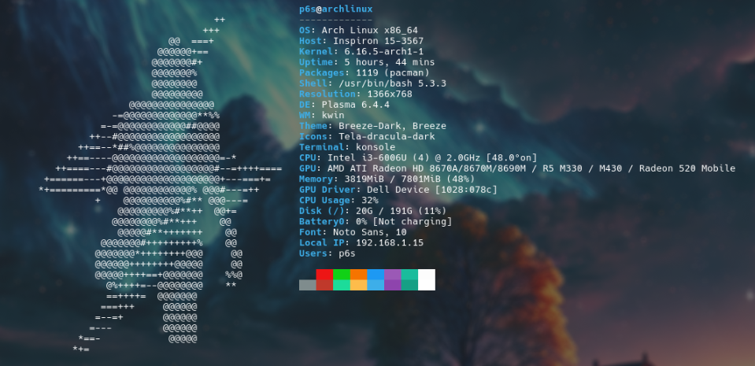

# p6sLinuxBash 🐧

A personalized Linux bash configuration setup featuring a beautiful Starship prompt with Gruvbox Dark theme, custom Neofetch display, and optimized bash environment for Arch Linux.

## ✨ Features

- **Custom Bash Configuration**: Optimized `.bashrc` with useful aliases and Flutter path
- **Starship Prompt**: Beautiful, fast, and customizable prompt with Gruvbox Dark theme
- **Neofetch Integration**: Custom ASCII art and system information display
- **Arch Linux Support**: Automated installation script for Arch-based systems
- **Developer-Friendly**: Includes support for multiple programming languages and tools

## 🖼️ Screenshots

### Terminal Appearance

*Custom Starship prompt with Gruvbox Dark theme and system information*

### Neofetch Display

*Custom ASCII art and system information display*

## 🚀 Quick Start

### Prerequisites
- Arch Linux or Arch-based distribution
- `sudo` privileges for package installation

### Installation

1. Clone the repository:
```bash
git clone https://github.com/yourusername/p6sLinuxBash.git
cd p6sLinuxBash
```

2. Run the installation script:
```bash
chmod +x install.sh
./install.sh
```

3. Restart your shell or source the new configuration:
```bash
source ~/.bashrc
```

## 📁 Repository Structure

```
p6sLinuxBash/
├── install.sh              # Installation script for Arch Linux
├── bashrc                  # Custom bash configuration
├── .config/
│   ├── starship.toml       # Starship prompt configuration
│   └── neofetch/
│       ├── config.conf     # Neofetch configuration
│       └── P6sAscii.txt    # Custom ASCII art
└── README.md               # This file
```

## ⚙️ Configuration Details

### Bash Configuration (`bashrc`)
- Colorized `ls` and `grep` commands
- Custom PS1 prompt
- Flutter SDK path configuration
- Neofetch on shell startup
- Starship prompt initialization

### Starship Prompt (`starship.toml`)
- **Theme**: Gruvbox Dark color palette
- **Modules**: OS, username, directory, git status, programming languages, Docker, Conda, time
- **Features**: 
  - Truncated directory paths
  - Git branch and status indicators
  - Language version detection (C, C++, Rust, Go, Node.js, PHP, Java, Kotlin, Haskell, Python)
  - Docker context display
  - Conda/Pixi environment support

### Neofetch Configuration (`config.conf`)
- Custom ASCII art from `P6sAscii.txt`
- Comprehensive system information display
- Optimized for Arch Linux systems
- Custom color scheme

## 🎨 Customization

### Changing the ASCII Art
Replace the content in `.config/neofetch/P6sAscii.txt` with your preferred ASCII art.

### Modifying the Starship Theme
Edit `.config/starship.toml` to customize:
- Color palette
- Module order and appearance
- Add or remove modules
- Change symbols and formatting

### Bash Aliases
Add your custom aliases to the `bashrc` file in the aliases section.

## 🛠️ Dependencies

The installation script automatically installs:
- `bash` - Shell environment
- `neofetch` - System information display
- `starship` - Cross-shell prompt

## 📝 Manual Installation

If you prefer manual installation:

1. Install dependencies:
```bash
sudo pacman -S bash neofetch starship
```

2. Create symbolic links:
```bash
ln -sf ~/p6sLinuxBash/bashrc ~/.bashrc
ln -sf ~/p6sLinuxBash/.config/starship.toml ~/.config/starship.toml
ln -sf ~/p6sLinuxBash/.config/neofetch ~/.config/neofetch
```

## 🤝 Contributing

Contributions are welcome! Feel free to:
- Report bugs
- Suggest new features
- Submit pull requests
- Improve documentation

## 📄 License

This project is open source and available under the [MIT License](LICENSE).

## 🙏 Acknowledgments

- [Starship](https://starship.rs/) - Cross-shell prompt
- [Neofetch](https://github.com/dylanaraps/neofetch) - System information tool
- [Gruvbox](https://github.com/morhetz/gruvbox) - Color scheme inspiration

---

**Note**: This configuration is optimized for Arch Linux. For other distributions, you may need to modify the installation script and package names accordingly.
